# Image Super Resolution With Resize-Conv

### Intr

...

### Theory

...

### DataSet

```shell
kaggle datasets download -d adityachandrasekhar/image-super-resolution
```

https://www.kaggle.com/datasets/adityachandrasekhar/image-super-resolution/data

### CoLab Experiment Link

https://colab.research.google.com/github/California3/super-resolution-resize-cv/blob/main/esay_training.ipynb

### **Models Performance Testing**

by Guangming Zeng u7100771

#### MODEL_NAME  = 'final_model'


```
Epoch 1/7
700/700 [==============================] - 11s 10ms/step - loss: 0.0517 - acc: 0.6935 - val_loss: 0.0284 - val_acc: 0.7351
Epoch 2/7
700/700 [==============================] - 6s 9ms/step - loss: 0.0240 - acc: 0.8016 - val_loss: 0.0228 - val_acc: 0.7692
Epoch 3/7
700/700 [==============================] - 6s 9ms/step - loss: 0.0214 - acc: 0.8147 - val_loss: 0.0243 - val_acc: 0.7593
Epoch 4/7
700/700 [==============================] - 6s 9ms/step - loss: 0.0203 - acc: 0.8265 - val_loss: 0.0211 - val_acc: 0.7562
Epoch 5/7
700/700 [==============================] - 6s 9ms/step - loss: 0.0198 - acc: 0.8278 - val_loss: 0.0193 - val_acc: 0.8890
Epoch 6/7
700/700 [==============================] - 6s 9ms/step - loss: 0.0187 - acc: 0.8391 - val_loss: 0.0187 - val_acc: 0.8870
Epoch 7/7
700/700 [==============================] - 6s 9ms/step - loss: 0.0181 - acc: 0.8483 - val_loss: 0.0193 - val_acc: 0.8825
Model Name: final_model
```


#### MODEL_NAME  = 'final_model_resize'


```
Epoch 1/7
700/700 [==============================] - 27s 31ms/step - loss: 0.0859 - acc: 0.5922 - val_loss: 0.0456 - val_acc: 0.8047
Epoch 2/7
700/700 [==============================] - 21s 31ms/step - loss: 0.0313 - acc: 0.7451 - val_loss: 0.0339 - val_acc: 0.6979
Epoch 3/7
700/700 [==============================] - 21s 30ms/step - loss: 0.0273 - acc: 0.7692 - val_loss: 0.0257 - val_acc: 0.7838
Epoch 4/7
700/700 [==============================] - 21s 31ms/step - loss: 0.0250 - acc: 0.7953 - val_loss: 0.0254 - val_acc: 0.7857
Epoch 5/7
700/700 [==============================] - 21s 31ms/step - loss: 0.0238 - acc: 0.8044 - val_loss: 0.0230 - val_acc: 0.8676
Epoch 6/7
700/700 [==============================] - 21s 31ms/step - loss: 0.0234 - acc: 0.7905 - val_loss: 0.0240 - val_acc: 0.7343
Epoch 7/7
700/700 [==============================] - 21s 30ms/step - loss: 0.0227 - acc: 0.8108 - val_loss: 0.0231 - val_acc: 0.8076
Model Name: final_model_resize
```


#### MODEL_NAME  = 'final_model_resize_v1'


```text
Epoch 1/8
700/700 [==============================] - 27s 31ms/step - loss: 0.0782 - acc: 0.6066 - val_loss: 0.0320 - val_acc: 0.7988
Epoch 2/8
700/700 [==============================] - 21s 30ms/step - loss: 0.0352 - acc: 0.7373 - val_loss: 0.0700 - val_acc: 0.5587
Epoch 3/8
700/700 [==============================] - 21s 30ms/step - loss: 0.0305 - acc: 0.7721 - val_loss: 0.0274 - val_acc: 0.7776
Epoch 4/8
700/700 [==============================] - 21s 30ms/step - loss: 0.0280 - acc: 0.7797 - val_loss: 0.0262 - val_acc: 0.8383
Epoch 5/8
700/700 [==============================] - 21s 30ms/step - loss: 0.0274 - acc: 0.7786 - val_loss: 0.0405 - val_acc: 0.7395
Epoch 6/8
700/700 [==============================] - 21s 30ms/step - loss: 0.8415 - acc: 0.6655 - val_loss: 0.0782 - val_acc: 0.6020
Epoch 7/8
700/700 [==============================] - 21s 30ms/step - loss: 0.0448 - acc: 0.6726 - val_loss: 0.0300 - val_acc: 0.7453
Epoch 8/8
700/700 [==============================] - 21s 30ms/step - loss: 0.0281 - acc: 0.7670 - val_loss: 0.0257 - val_acc: 0.8225
Model Name: final_model_resize_v1
```


#### MODEL_NAME  = 'final_model_resize_v2'


```
Epoch 1/7
700/700 [==============================] - 25s 30ms/step - loss: 0.0803 - acc: 0.5638 - val_loss: 0.0462 - val_acc: 0.6385
Epoch 2/7
700/700 [==============================] - 20s 29ms/step - loss: 0.0374 - acc: 0.7148 - val_loss: 0.0332 - val_acc: 0.7140
Epoch 3/7
700/700 [==============================] - 20s 29ms/step - loss: 0.0320 - acc: 0.7570 - val_loss: 0.0299 - val_acc: 0.7457
Epoch 4/7
700/700 [==============================] - 20s 29ms/step - loss: 0.0301 - acc: 0.7564 - val_loss: 0.0664 - val_acc: 0.6765
Epoch 5/7
700/700 [==============================] - 20s 29ms/step - loss: 0.0286 - acc: 0.7744 - val_loss: 0.0248 - val_acc: 0.8682
Epoch 6/7
700/700 [==============================] - 20s 29ms/step - loss: 0.0282 - acc: 0.7707 - val_loss: 0.0310 - val_acc: 0.8577
Epoch 7/7
700/700 [==============================] - 20s 29ms/step - loss: 0.0258 - acc: 0.7864 - val_loss: 0.0293 - val_acc: 0.7500
Model Name: final_model_resize_v2
```


#### MODEL_NAME  = 'final_model_resize_v4'


```
Epoch 1/7
700/700 [==============================] - 23s 27ms/step - loss: 0.0499 - acc: 0.6881 - val_loss: 0.0310 - val_acc: 0.7955
Epoch 2/7
700/700 [==============================] - 18s 26ms/step - loss: 0.0265 - acc: 0.7956 - val_loss: 0.0274 - val_acc: 0.8006
Epoch 3/7
700/700 [==============================] - 18s 26ms/step - loss: 0.0242 - acc: 0.7981 - val_loss: 0.0233 - val_acc: 0.7643
Epoch 4/7
700/700 [==============================] - 18s 26ms/step - loss: 0.0230 - acc: 0.8086 - val_loss: 0.0272 - val_acc: 0.7561
Epoch 5/7
700/700 [==============================] - 18s 26ms/step - loss: 0.0217 - acc: 0.8196 - val_loss: 0.0237 - val_acc: 0.7770
Epoch 6/7
700/700 [==============================] - 18s 26ms/step - loss: 0.0988 - acc: 0.7217 - val_loss: 0.0321 - val_acc: 0.7467
Epoch 7/7
700/700 [==============================] - 18s 26ms/step - loss: 0.0263 - acc: 0.7844 - val_loss: 0.0265 - val_acc: 0.7592
Model Name: final_model_resize_v4
```


#### MODEL_NAME  = 'final_model_resize_v3'


```
Epoch 1/7
700/700 [==============================] - 20s 23ms/step - loss: 0.0802 - acc: 0.6050 - val_loss: 0.0891 - val_acc: 0.5100
Epoch 2/7
700/700 [==============================] - 16s 22ms/step - loss: 0.0375 - acc: 0.7111 - val_loss: 0.0458 - val_acc: 0.7132
Epoch 3/7
700/700 [==============================] - 16s 22ms/step - loss: 0.0316 - acc: 0.7496 - val_loss: 0.0292 - val_acc: 0.8176
Epoch 4/7
700/700 [==============================] - 16s 22ms/step - loss: 0.0289 - acc: 0.7657 - val_loss: 0.0420 - val_acc: 0.6735
Epoch 5/7
700/700 [==============================] - 16s 22ms/step - loss: 0.0262 - acc: 0.7844 - val_loss: 0.0288 - val_acc: 0.6921
Epoch 6/7
700/700 [==============================] - 16s 22ms/step - loss: 0.0247 - acc: 0.7922 - val_loss: 0.0223 - val_acc: 0.8034
Epoch 7/7
700/700 [==============================] - 16s 22ms/step - loss: 0.0233 - acc: 0.8073 - val_loss: 0.0209 - val_acc: 0.8189
Model Name: final_model_resize_v3
```


#### MODEL_NAME  = 'final_model_resize_v1-1'


```
Epoch 1/9
700/700 [==============================] - 26s 31ms/step - loss: 0.0792 - acc: 0.6011 - val_loss: 0.0419 - val_acc: 0.7787
Epoch 2/9
700/700 [==============================] - 21s 30ms/step - loss: 0.0362 - acc: 0.7351 - val_loss: 0.0285 - val_acc: 0.8183
Epoch 3/9
700/700 [==============================] - 21s 30ms/step - loss: 0.0301 - acc: 0.7763 - val_loss: 0.0289 - val_acc: 0.7402
Epoch 4/9
700/700 [==============================] - 21s 30ms/step - loss: 0.0266 - acc: 0.7777 - val_loss: 0.0251 - val_acc: 0.7680
Epoch 5/9
700/700 [==============================] - 21s 30ms/step - loss: 0.0250 - acc: 0.7941 - val_loss: 0.0256 - val_acc: 0.7968
Epoch 6/9
700/700 [==============================] - 21s 30ms/step - loss: 1.7398 - acc: 0.4838 - val_loss: 0.0476 - val_acc: 0.6081
Epoch 7/9
700/700 [==============================] - 21s 30ms/step - loss: 0.0396 - acc: 0.6886 - val_loss: 0.0424 - val_acc: 0.6879
Epoch 8/9
700/700 [==============================] - 21s 30ms/step - loss: 0.0310 - acc: 0.7604 - val_loss: 0.0261 - val_acc: 0.8297
Epoch 9/9
700/700 [==============================] - 21s 30ms/step - loss: 0.0274 - acc: 0.7882 - val_loss: 0.0294 - val_acc: 0.8124
Model Name: final_model_resize_v1-1
```


#### MODEL_NAME  = 'final_model_resize_v1-2'

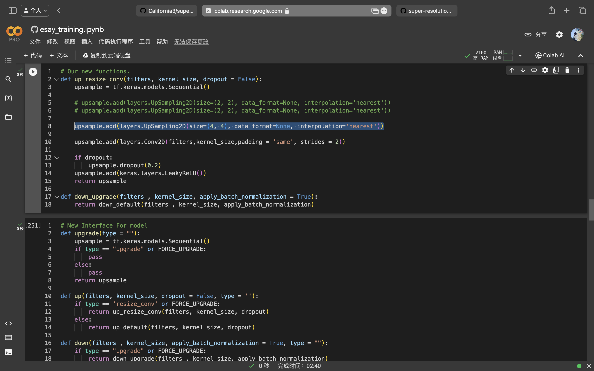

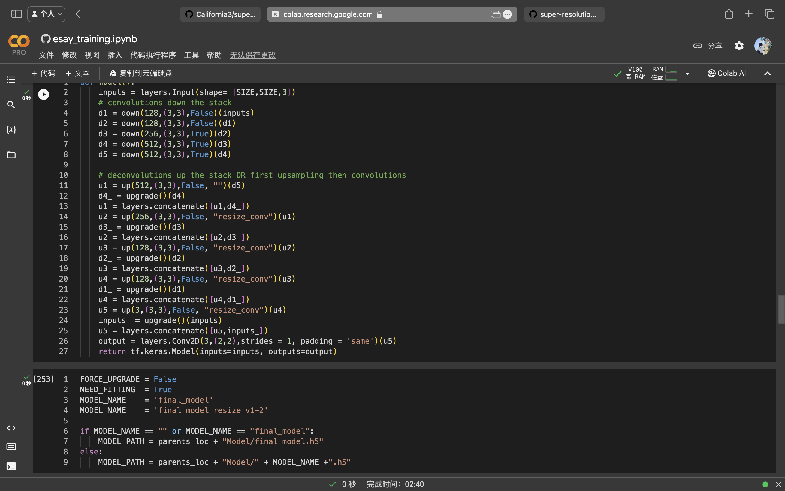

```
Epoch 1/7
700/700 [==============================] - 25s 30ms/step - loss: 0.0804 - acc: 0.5574 - val_loss: 0.0465 - val_acc: 0.7042
Epoch 2/7
700/700 [==============================] - 20s 29ms/step - loss: 0.0371 - acc: 0.7257 - val_loss: 0.0390 - val_acc: 0.6567
Epoch 3/7
700/700 [==============================] - 20s 29ms/step - loss: 0.0331 - acc: 0.7380 - val_loss: 0.0290 - val_acc: 0.7304
Epoch 4/7
700/700 [==============================] - 20s 29ms/step - loss: 0.0301 - acc: 0.7554 - val_loss: 0.0363 - val_acc: 0.7815
Epoch 5/7
700/700 [==============================] - 20s 29ms/step - loss: 0.0273 - acc: 0.7763 - val_loss: 0.0266 - val_acc: 0.7624
Epoch 6/7
700/700 [==============================] - 20s 29ms/step - loss: 0.8933 - acc: 0.6923 - val_loss: 0.0608 - val_acc: 0.6532
Epoch 7/7
700/700 [==============================] - 20s 29ms/step - loss: 0.0393 - acc: 0.6878 - val_loss: 0.0335 - val_acc: 0.7312
Model Name: final_model_resize_v1-2
```

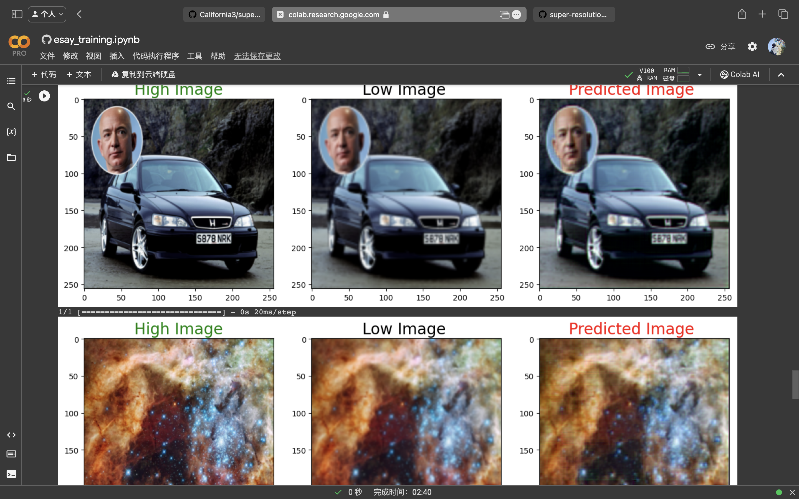

```
Epoch 1/6
700/700 [==============================] - 26s 30ms/step - loss: 0.0928 - acc: 0.5818 - val_loss: 0.0406 - val_acc: 0.7158
Epoch 2/6
700/700 [==============================] - 20s 29ms/step - loss: 0.0354 - acc: 0.7343 - val_loss: 0.0309 - val_acc: 0.7449
Epoch 3/6
700/700 [==============================] - 20s 29ms/step - loss: 0.0314 - acc: 0.7515 - val_loss: 0.0347 - val_acc: 0.6611
Epoch 4/6
700/700 [==============================] - 20s 29ms/step - loss: 0.0280 - acc: 0.7825 - val_loss: 0.0262 - val_acc: 0.8668
Epoch 5/6
700/700 [==============================] - 20s 29ms/step - loss: 0.0273 - acc: 0.7745 - val_loss: 0.0307 - val_acc: 0.7995
Epoch 6/6
700/700 [==============================] - 20s 29ms/step - loss: 0.0255 - acc: 0.7821 - val_loss: 0.0286 - val_acc: 0.8407
Model Name: final_model_resize_1-2
```

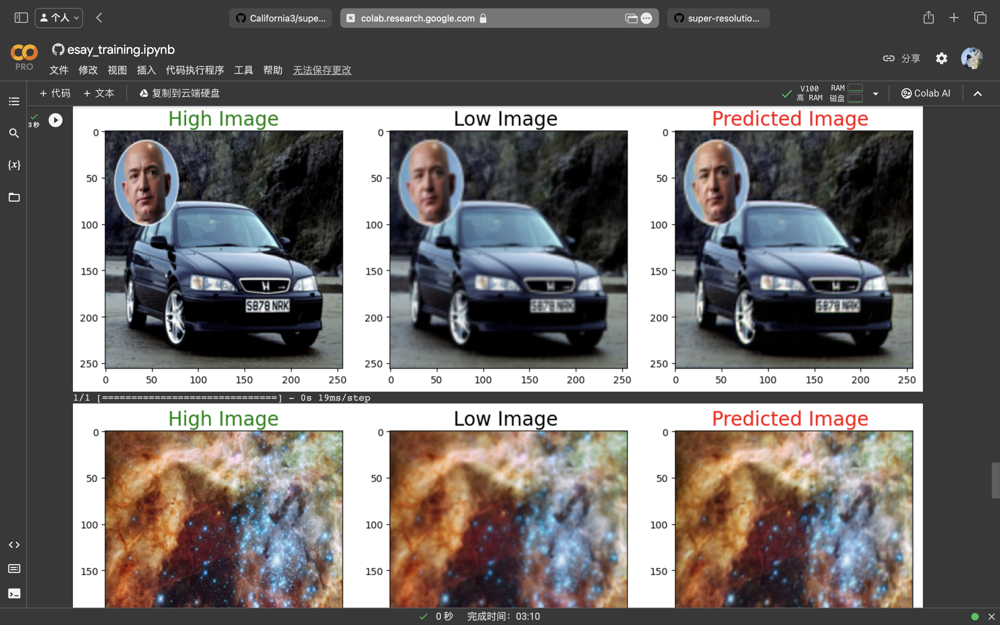

#### MODEL_NAME  = 'final_model_resize0-2'

结果不稳定，当 epoch 超过或在 7 时。

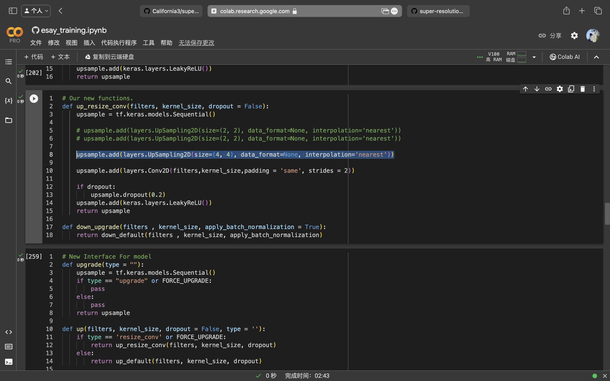


```
Epoch 1/6
700/700 [==============================] - 26s 30ms/step - loss: 0.0879 - acc: 0.6426 - val_loss: 0.0430 - val_acc: 0.6703
Epoch 2/6
700/700 [==============================] - 21s 29ms/step - loss: 0.0310 - acc: 0.7489 - val_loss: 0.0293 - val_acc: 0.7118
Epoch 3/6
700/700 [==============================] - 21s 29ms/step - loss: 0.0278 - acc: 0.7780 - val_loss: 0.0259 - val_acc: 0.7576
Epoch 4/6
700/700 [==============================] - 21s 29ms/step - loss: 0.0252 - acc: 0.7890 - val_loss: 0.0337 - val_acc: 0.7744
Epoch 5/6
700/700 [==============================] - 21s 29ms/step - loss: 0.0242 - acc: 0.7982 - val_loss: 0.0216 - val_acc: 0.8363
Epoch 6/6
700/700 [==============================] - 21s 29ms/step - loss: 0.0226 - acc: 0.8153 - val_loss: 0.0290 - val_acc: 0.7554
Model Name: final_model_resize_v0-2
```

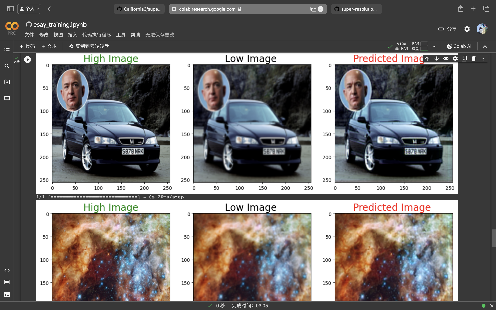

#### MODEL_NAME  = 'final_model_resize_v2-2'

会得到很好的结果，在限定 epoch 7 内。结果不稳定，当 epoch 超过 7 时。

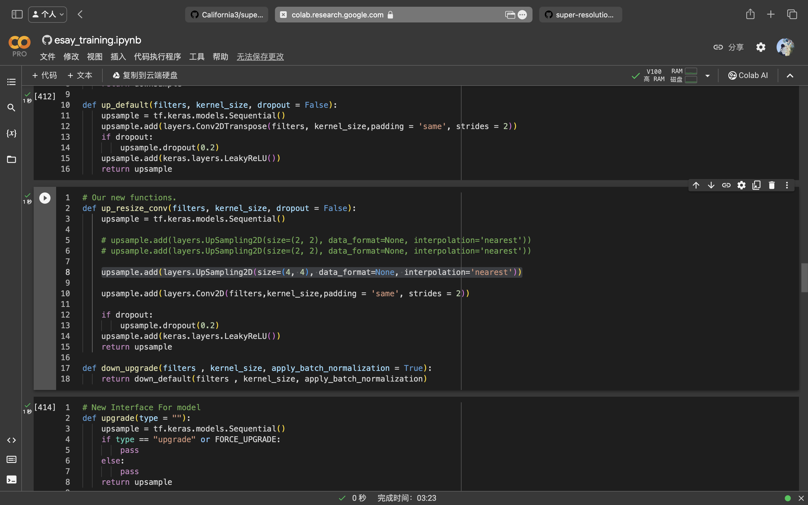


```
Epoch 1/7
700/700 [==============================] - 25s 29ms/step - loss: 0.0723 - acc: 0.5324 - val_loss: 0.0470 - val_acc: 0.7253
Epoch 2/7
700/700 [==============================] - 19s 28ms/step - loss: 0.0345 - acc: 0.7245 - val_loss: 0.0337 - val_acc: 0.7175
Epoch 3/7
700/700 [==============================] - 19s 28ms/step - loss: 0.0300 - acc: 0.7586 - val_loss: 0.0314 - val_acc: 0.7986
Epoch 4/7
700/700 [==============================] - 19s 28ms/step - loss: 0.0295 - acc: 0.7591 - val_loss: 0.0257 - val_acc: 0.8398
Epoch 5/7
700/700 [==============================] - 19s 28ms/step - loss: 0.0267 - acc: 0.7788 - val_loss: 0.0254 - val_acc: 0.7852
Epoch 6/7
700/700 [==============================] - 19s 28ms/step - loss: 0.0258 - acc: 0.7886 - val_loss: 0.0322 - val_acc: 0.7253
Epoch 7/7
700/700 [==============================] - 19s 28ms/step - loss: 0.0254 - acc: 0.7822 - val_loss: 0.0246 - val_acc: 0.8771
Model Name: final_model_resize_2-2
```

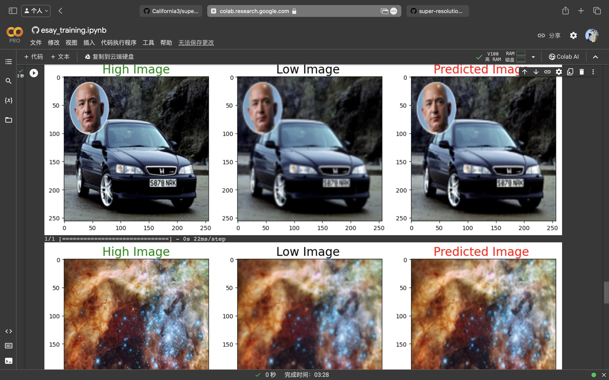

#### MODEL_NAME  = 'final_model_resize_v3-2'


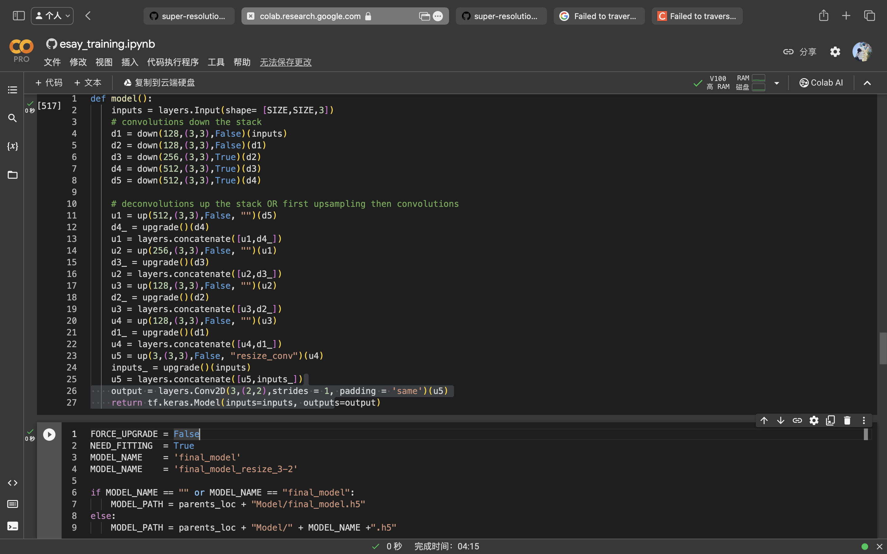

```
Epoch 1/7
700/700 [==============================] - 20s 23ms/step - loss: 0.0640 - acc: 0.5816 - val_loss: 0.0385 - val_acc: 0.6961
Epoch 2/7
700/700 [==============================] - 15s 22ms/step - loss: 0.0352 - acc: 0.7303 - val_loss: 0.0335 - val_acc: 0.7157
Epoch 3/7
700/700 [==============================] - 15s 21ms/step - loss: 0.0295 - acc: 0.7610 - val_loss: 0.0266 - val_acc: 0.7631
Epoch 4/7
700/700 [==============================] - 15s 22ms/step - loss: 0.0278 - acc: 0.7757 - val_loss: 0.0336 - val_acc: 0.7623
Epoch 5/7
700/700 [==============================] - 15s 22ms/step - loss: 0.0284 - acc: 0.7683 - val_loss: 0.0237 - val_acc: 0.8707
Epoch 6/7
700/700 [==============================] - 15s 21ms/step - loss: 0.0256 - acc: 0.7887 - val_loss: 0.0235 - val_acc: 0.7640
Epoch 7/7
700/700 [==============================] - 15s 21ms/step - loss: 0.0245 - acc: 0.7849 - val_loss: 0.0298 - val_acc: 0.7949
Model Name: final_model_resize_3-2
```

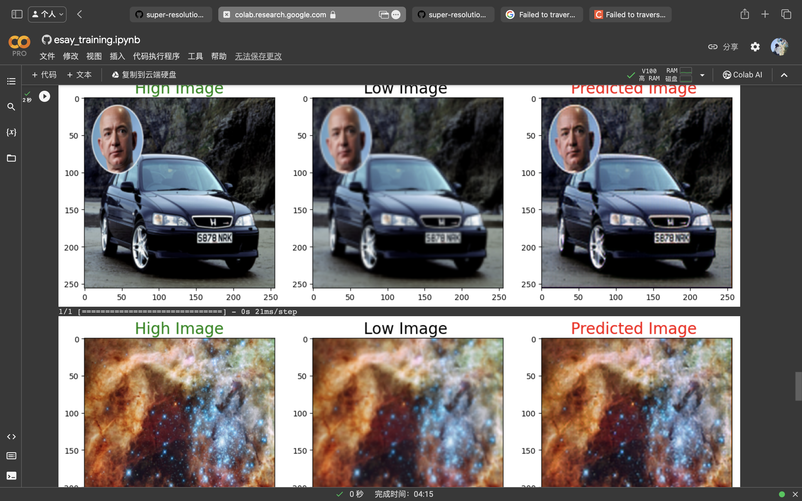

#### MODEL_NAME  = 'final_model_resize_v4-2'

epoch 超过或等于 9 时，开始变差。在之前，表现均衡且良好。


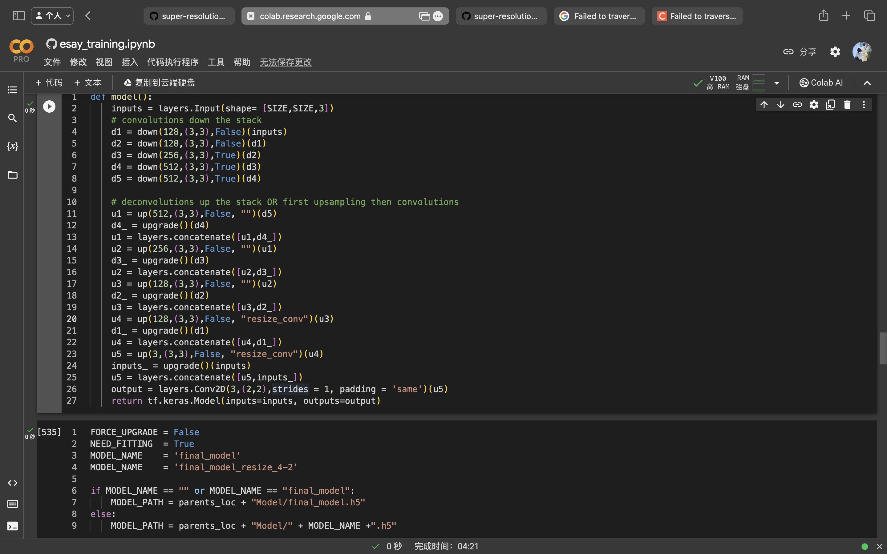

```
Epoch 1/7
700/700 [==============================] - 23s 26ms/step - loss: 0.0698 - acc: 0.6047 - val_loss: 0.0387 - val_acc: 0.6581
Epoch 2/7
700/700 [==============================] - 18s 25ms/step - loss: 0.0323 - acc: 0.7337 - val_loss: 0.0262 - val_acc: 0.7842
Epoch 3/7
700/700 [==============================] - 18s 25ms/step - loss: 0.0294 - acc: 0.7423 - val_loss: 0.0282 - val_acc: 0.8123
Epoch 4/7
700/700 [==============================] - 18s 25ms/step - loss: 0.0274 - acc: 0.7706 - val_loss: 0.0389 - val_acc: 0.7712
Epoch 5/7
700/700 [==============================] - 18s 25ms/step - loss: 0.0262 - acc: 0.7657 - val_loss: 0.0225 - val_acc: 0.8061
Epoch 6/7
700/700 [==============================] - 18s 25ms/step - loss: 0.0264 - acc: 0.7657 - val_loss: 0.0225 - val_acc: 0.8193
Epoch 7/7
700/700 [==============================] - 18s 25ms/step - loss: 0.0245 - acc: 0.7821 - val_loss: 0.0215 - val_acc: 0.8571
Model Name: final_model_resize_4-2
```

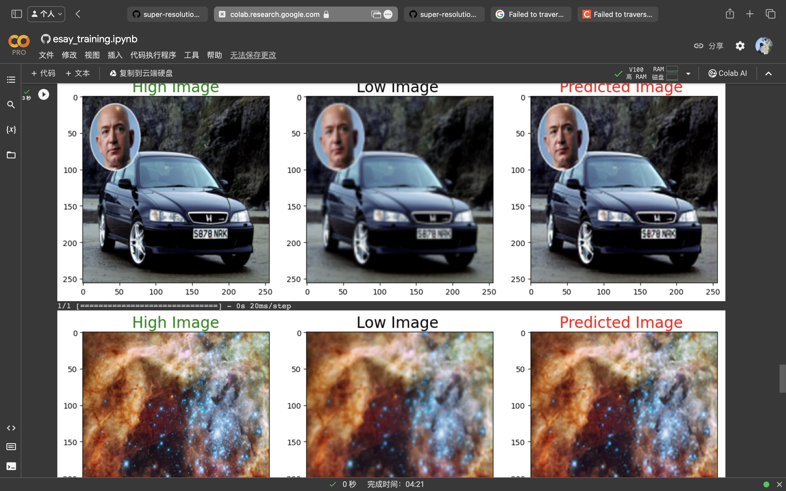

```
Epoch 1/8
700/700 [==============================] - 23s 26ms/step - loss: 0.0566 - acc: 0.6519 - val_loss: 0.0332 - val_acc: 0.7060
Epoch 2/8
700/700 [==============================] - 18s 25ms/step - loss: 0.0304 - acc: 0.7624 - val_loss: 0.0284 - val_acc: 0.8292
Epoch 3/8
700/700 [==============================] - 18s 25ms/step - loss: 0.0258 - acc: 0.7881 - val_loss: 0.0239 - val_acc: 0.7732
Epoch 4/8
700/700 [==============================] - 18s 25ms/step - loss: 0.0240 - acc: 0.7942 - val_loss: 0.0230 - val_acc: 0.8153
Epoch 5/8
700/700 [==============================] - 18s 25ms/step - loss: 0.0505 - acc: 0.7280 - val_loss: 0.0311 - val_acc: 0.7206
Epoch 6/8
700/700 [==============================] - 18s 25ms/step - loss: 0.0249 - acc: 0.8027 - val_loss: 0.0230 - val_acc: 0.8001
Epoch 7/8
700/700 [==============================] - 18s 25ms/step - loss: 0.0226 - acc: 0.8128 - val_loss: 0.0210 - val_acc: 0.8170
Epoch 8/8
700/700 [==============================] - 18s 25ms/step - loss: 0.0213 - acc: 0.8246 - val_loss: 0.0211 - val_acc: 0.8757
Model Name: final_model_resize_4-2
```

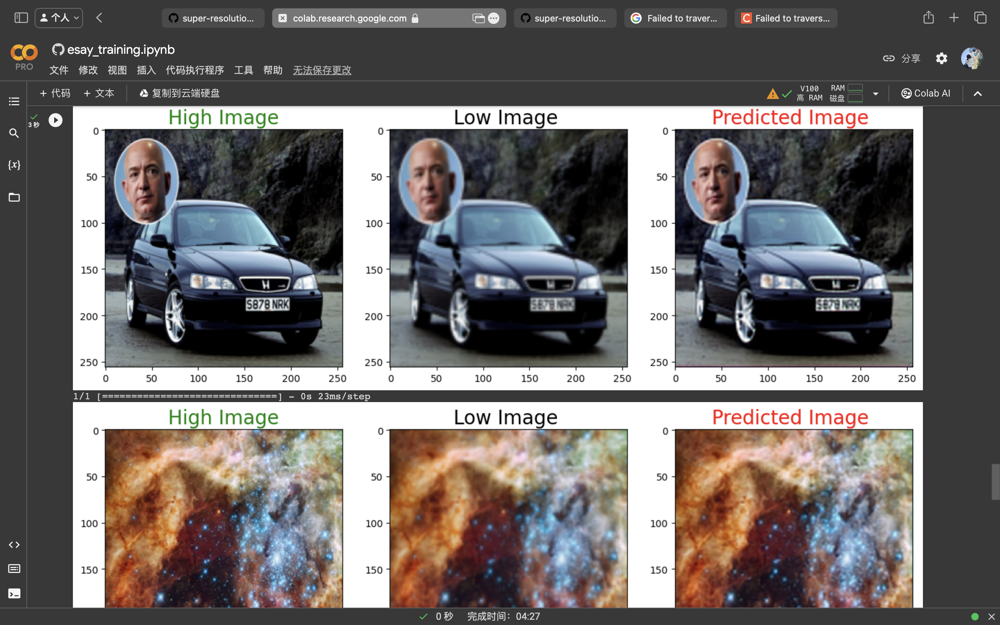